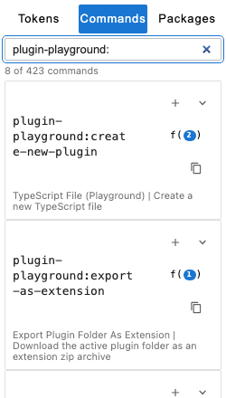
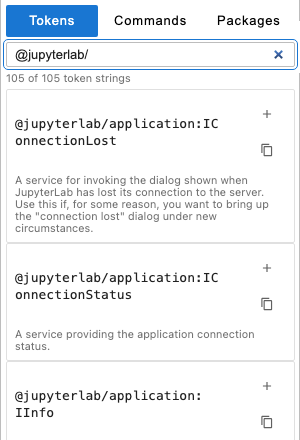
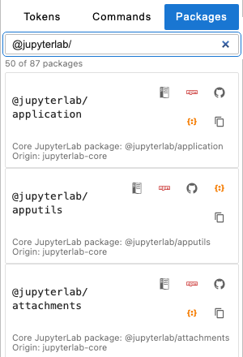
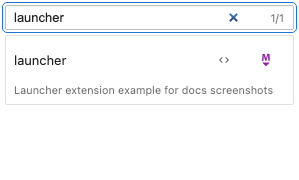
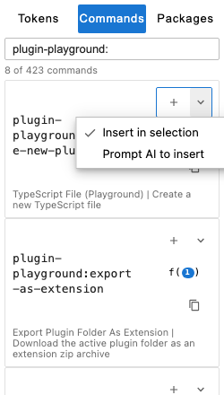
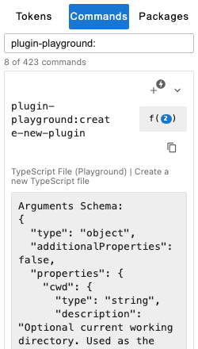
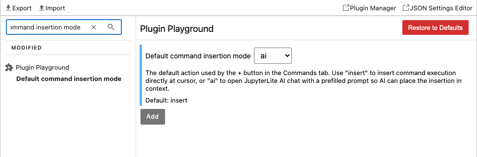

# JupyterLab Plugin Playground

[](https://github.com/jupyterlab/plugin-playground/actions/workflows/build.yml)

| Preview     | Lab                                                                                                                                                       | Notebook v7                                                                                                                                                            |
| ----------- | --------------------------------------------------------------------------------------------------------------------------------------------------------- | ---------------------------------------------------------------------------------------------------------------------------------------------------------------------- |
| Binder      | [](https://mybinder.org/v2/gh/jupyterlab/plugin-playground/main?urlpath=lab)                                | [](https://mybinder.org/v2/gh/jupyterlab/plugin-playground/main?urlpath=tree)                                |
| JupyterLite | [](https://jupyterlab-plugin-playground.readthedocs.io/en/latest/lite/lab/) | [](https://jupyterlab-plugin-playground.readthedocs.io/en/latest/lite/tree/) |

A JupyterLab extension to write and load simple JupyterLab plugins inside JupyterLab.

## Install

This extension requires JupyterLab 4. Install this extension with pip:

```bash
pip install jupyterlab-plugin-playground
```

## How to use the Plugin Playground

### Feature Highlights

Plugin Playground is built to keep the full plugin prototyping workflow inside JupyterLab. In the editor toolbar, you can load the active file as an extension, export the current plugin folder as a starter extension archive, copy a shareable plugin link, and enable per-file `Auto Load on Save` for faster iteration while editing.


The right sidebar includes a single Plugin Playground panel with two collapsible sections. In **Extension Points**, the `Tokens` tab helps you discover available token strings and insert import/dependency updates, the `Commands` tab lets you search command IDs, inspect argument docs, and insert execution snippets (either directly or through AI-assisted prompt mode), and the `Packages` tab surfaces package docs plus npm and repository links for known modules.





The **Extension Examples** section lists discovered examples from `extension-examples/` and lets you open source entrypoints and README files directly. This keeps reference implementations close while you prototype.



Command completion is also included for `app.commands.execute(...)` / `commands.execute(...)` in JavaScript and TypeScript editors, and Notebook v7 integrates `Plugin (Playground)` into New-file flows so you can create starter plugin files from the tree interface.

To regenerate the screenshots used in this README:

```bash
jlpm docs:screenshots
```

### Quick Start

1. Create a file with `TypeScript File (Playground)` (Command Palette) or `Plugin (Playground)` (Notebook v7 New menu).
2. Paste plugin code into the active editor.
3. Run `Load Current File As Extension` from the editor toolbar or Command Palette.
4. Use `Auto Load on Save` for fast iteration on one file.
5. Use the sidebar to discover tokens, commands, packages, and extension examples.

For extension examples availability:

- For source checkouts: run `git submodule update --init --recursive`.
- PyPI installs: bundled examples are copied into `extension-examples/` automatically when the server extension starts.

When reloading a plugin with the same `id`, Plugin Playground attempts to deactivate and deregister the previous plugin before loading the new one. Defining `deactivate()` is still recommended for clean reruns.

As an example, open the text editor by creating a new text file and paste this small JupyterLab plugin into it. This plugin creates a simple command `My Super Cool Toggle` in the command palette that can be toggled on and off.

```typescript
import { ICommandPalette } from '@jupyterlab/apputils';

const plugin = {
  id: 'my-super-cool-toggle:plugin',
  autoStart: true, // Activate this plugin immediately
  requires: [ICommandPalette],
  activate: function (app, palette) {
    let commandID = 'my-super-cool-toggle:toggle';
    let toggle = true; // The current toggle state
    app.commands.addCommand(commandID, {
      label: 'My Super Cool Toggle',
      isToggled: function () {
        return toggle;
      },
      execute: function () {
        // Toggle the state
        toggle = !toggle;
      }
    });

    palette.addItem({
      command: commandID,
      // Sort to the top for convenience
      category: 'AAA'
    });
  }
};

export default plugin;
```

While in the text editor, load this plugin in JupyterLab by invoking the Command Palette and executing `Load Current File As Extension`. Invoke the Command Palette again and you will see a new command "My Super Cool Toggle". Executing this new command will toggle the checkbox next to the command.

As another more advanced example, we load the [bqplot](https://bqplot.readthedocs.io) Jupyter Widget library from the cloud using RequireJS. This assumes you have the [ipywidgets JupyterLab extension](https://ipywidgets.readthedocs.io/en/stable/user_install.html#installing-in-jupyterlab) installed.

```typescript
// IJupyterWidgetRegistry token is provided with Plugin Playground
import { IJupyterWidgetRegistry } from '@jupyter-widgets/base';
// Use RequireJS to load the AMD module. '@*' selects the latest version
// and `/dist/index.js` loads the corresponding module containing bqplot
// from the CDN configured in Settings (`requirejsCDN`).
import bqplot from 'bqplot@*/dist/index';

const plugin = {
  id: 'mydynamicwidget',
  autoStart: true,
  requires: [IJupyterWidgetRegistry],
  activate: function (app, widgets: IJupyterWidgetRegistry) {
    widgets.registerWidget({
      name: 'bqplot',
      version: bqplot.version,
      exports: bqplot
    });
  }
};
export default plugin;
```

There are a few differences in how to write plugins in Plugin Playground compared to writing a full JupyterLab extension:

- The playground is more forgiving: you can use JavaScript-like code rather than strictly typed TypeScript and it will still compile.
- You can load a plugin with a given `id` more than once during iteration. Plugin Playground attempts to deactivate and deregister the previous version before registering the new one. Defining `deactivate()` in your plugin is still recommended for predictable cleanup between reloads.
- To load code from an external package, RequireJS is used (hidden behind ES module-compatible import syntax), so import statements may need explicit version or file paths.
  - In addition to JupyterLab and Lumino packages, only AMD modules can be imported; ES modules and modules compiled for Webpack/Node are not supported directly and can fail with `Uncaught SyntaxError: Unexpected token 'export'`.
- While the playground can import relative files (`.ts`), load SVG as strings, and load `plugin.json` schema for rapid prototyping, these capabilities are still evolving; other resources such as CSS files are not currently supported.

### Migrating from version 0.3.0

Version 0.3.0 supported only object-based plugins and `require.js` based imports.
While the object-based syntax for defining plugins remains supported, using `require` global reference is now deprecated.

A future version will remove `require` object to prevent confusion between `require` from `require.js`, and native `require` syntax;
please use `requirejs` (an alias function with the same signature) instead, or migrate to ES6-syntax plugins.
Require.js is not available in the ES6-syntax based plugins.

To migrate to the ES6-compatible syntax:

- assign the plugin object to a variable, e.g. `const plugin = { /* plugin code without changes */ };`,
- add `export default plugin;` line,
- convert `require()` calls to ES6 default imports.

## AI Tooling (Lite + Binder)

Plugin Playground supports AI-assisted extension prototyping in both JupyterLite and Binder deployments.

- In JupyterLite, you can use browser-based AI chat and completions.
- In Binder (JupyterLab), you can use the same JupyterLite AI tooling.

### Quick Start

1. Launch Plugin Playground in Lite or Binder.
2. Open the AI settings panel.
3. Add a provider and choose a model.
4. Enter your provider API key and save.
5. Ask the assistant to draft or refine plugin code, then run `Load Current File As Extension`.

### Provider Setup Help

- [JupyterLite AI documentation](https://jupyterlite-ai.readthedocs.io/en/latest/)
- [Plugin authoring skill for agents](_agents/skills/plugin-authoring/SKILL.md)

### Command Insert Modes (Default + AI Prompt)

In the `Commands` tab, each command row includes a split `+` action and a mode dropdown:

- `Insert in selection` inserts:

  ```ts
  app.commands.execute('<command-id>');
  ```

  at the active cursor position in the current editor.

- `Prompt AI to insert` does not insert directly. It opens JupyterLite AI chat and prefills a contextual prompt so AI can choose a better insertion location before you submit.



The same command row also includes the `f(n)` button to inspect command argument docs inline before insertion.



The sidebar remembers your last-used command insert mode in:

- `commandInsertDefaultMode` (`insert` or `ai`, `insert` by default)

### Commands for AI Agents and Automation

Plugin Playground exposes command APIs for scripting, agents, and automation:

- `plugin-playground:create-new-plugin` (supports optional `{ cwd?: string, path?: string }`)
- `plugin-playground:load-as-extension`
- `plugin-playground:open-js-explorer`
- `plugin-playground:list-tokens` (supports optional `{ query?: string }`)
- `plugin-playground:list-commands` (supports optional `{ query?: string }`)
- `plugin-playground:list-extension-examples` (supports optional `{ query?: string }`)
- `plugin-playground:export-as-extension` (supports optional `{ path?: string }`)
- `plugin-playground:share-via-link` (supports optional `{ path?: string }`)

Example:

```typescript
await app.commands.execute('plugin-playground:create-new-plugin', {
  cwd: 'my-extension/src',
  path: 'index.ts'
});

await app.commands.execute('plugin-playground:list-tokens', {
  query: 'notebook'
});

await app.commands.execute('plugin-playground:export-as-extension', {
  path: 'my-extension/src/index.ts'
});

await app.commands.execute('plugin-playground:share-via-link', {
  path: 'my-extension/src/index.ts'
});
```

`plugin-playground:share-via-link` shares a single file. If no `path` is
provided, it shares the active file.
The same action is also available from the `IPluginPlayground` API via
`shareViaLink(path?)`.

When opening a shared URL, Plugin Playground restores and opens the shared
file but does not execute it automatically. Run `Load Current File As
Extension` when you are ready.

List commands (`list-tokens`, `list-commands`, `list-extension-examples`)
return a JSON object with:

- `query`: the filter text that was applied
- `total`: total number of available records
- `count`: number of records returned after filtering
- `items`: matching records

`export-as-extension` and `share-via-link` return operation-specific metadata
(for example, success status, paths, counts, URL length, and optional message).

## Advanced Settings

Plugin Playground settings are available in `Settings > Settings Editor > Plugin Playground`. These settings are intended to support both quick experiments and repeatable startup workflows.

`allowCDN` controls whether unknown packages can be executed from a CDN. The default `awaiting-decision` mode keeps things explicit, while `always-insecure` and `never` let you enforce a fixed policy.

`requirejsCDN` defines the base URL used by RequireJS to resolve unknown package imports (for example `https://cdn.jsdelivr.net/npm/`). If you rely on external AMD packages in prototypes, this setting determines where those packages are fetched from.

`loadOnSave` enables automatic load-as-extension behavior on save for supported editor files (JavaScript and TypeScript). This is useful when iterating quickly without repeatedly triggering the load command manually.

`commandInsertDefaultMode` sets the default behavior for the `+` action in the Commands tab (`insert` for direct insertion or `ai` for AI-assisted prompt flow).



For startup automation, there are two complementary settings:

- `urls` is a list of plugin URLs that are fetched and loaded at startup. This is useful for hosting a plugin source file externally (for example, a gist or internal text endpoint) and keeping clients in sync.
- `plugins` is a list of plugin source strings loaded at startup. This is useful for embedding short startup plugins directly in settings. Because these are JSON strings, multiline code must encode line breaks as `\n\`.

Example:

```json5
{
  allowCDN: 'awaiting-decision',
  requirejsCDN: 'https://cdn.jsdelivr.net/npm/',
  loadOnSave: false,
  commandInsertDefaultMode: 'insert',
  urls: ['https://gist.githubusercontent.com/.../raw/plugin.ts'],
  plugins: [
    "{ \n\
      id: 'MyConsoleLoggingPlugin', \n\
      autoStart: true, \n\
      activate: function(app) { \n\
        console.log('Activated!'); \n\
      } \n\
    }"
  ]
}
```

## Contributing

### Development install

You will need NodeJS to build the extension package.

```bash
# Clone the repo to your local environment
# Change directory to the jupyterlab-plugin-playground directory
# Install package in development mode
pip install -e .
# Link your development version of the extension with JupyterLab
jupyter labextension develop . --overwrite
# Rebuild extension Typescript source after making changes
jlpm run build
```

### Pre-commit hooks

Install and enable hooks:

```bash
python -m pip install pre-commit
pre-commit install
```

Run all configured hooks once after setup:

```bash
pre-commit run --all-files
```

Useful commands:

- `pre-commit run --files <path ...>`: run hooks for specific files only.
- `pre-commit autoupdate`: update pinned hook versions.

You can watch the source directory and run JupyterLab at the same time in different terminals to watch for changes in the extension's source and automatically rebuild the extension.

```bash
# Watch the source directory in one terminal, automatically rebuilding when needed
jlpm run watch
# Run JupyterLab in another terminal
jupyter lab
```

With the watch command running, every saved change will immediately be built locally and available in your running JupyterLab. Refresh JupyterLab to load the change in your browser (you may need to wait several seconds for the extension to be rebuilt).

By default, the `jlpm run build` command generates the source maps for this extension to make it easier to debug using the browser dev tools. To also generate source maps for the JupyterLab core extensions, you can run the following command:

```bash
jupyter lab build --minimize=False
```

### Integration tests

Integration tests live in `ui-tests` (Playwright + Galata).

Run from repository root:

```bash
jlpm run build:prod
jlpm run test:integration
jlpm run docs:screenshots
```

setup:

```bash
cd ui-tests
jlpm install
jlpm playwright install chromium
```

See `ui-tests/README.md` for focused test commands.

### Development uninstall

```bash
pip uninstall jupyterlab-plugin-playground
```

In development mode, you will also need to remove the symlink created by `jupyter labextension develop`
command. To find its location, you can run `jupyter labextension list` to figure out where the `labextensions`
folder is located. Then you can remove the symlink named `@jupyterlab/plugin-playground` within that folder.

### Packaging the extension

See [RELEASE](RELEASE.md)
